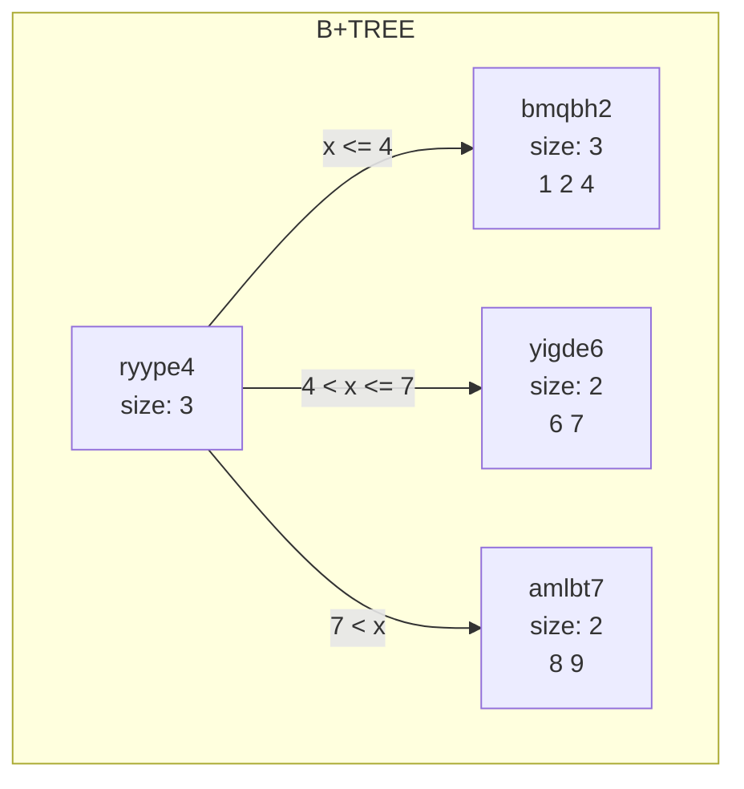
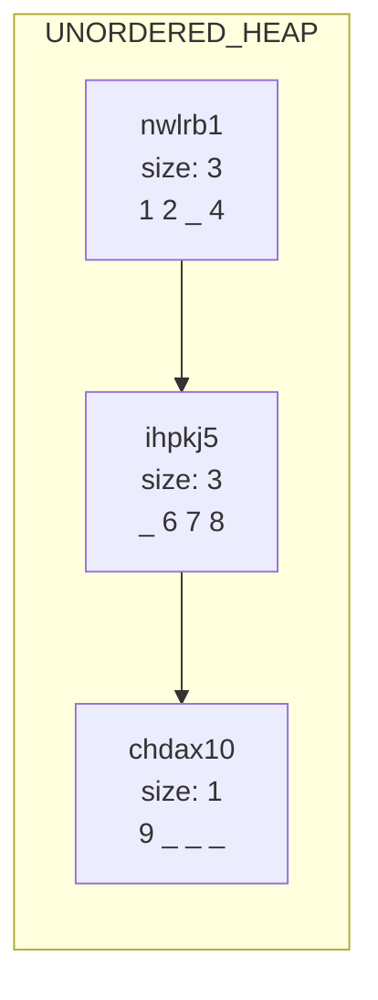

```mermaid
graph TD
subgraph B+TREE
ryype4[ryype4<br/>size: 3<br/>]
bmqbh2[bmqbh2<br/>size: 3<br/>1 2 4 ]
ryype4-->|x <= 4|bmqbh2
yigde6[yigde6<br/>size: 2<br/>6 7 ]
ryype4-->|4 < x <= 7|yigde6
amlbt7[amlbt7<br/>size: 2<br/>8 9 ]
ryype4-->|7 < x|amlbt7
end
```

```mermaid
graph LR
subgraph UNORDERED_HEAP
nwlrb1[nwlrb1<br/>size: 3<br/>1 2 _ 4 ]
ihpkj5[ihpkj5<br/>size: 3<br/>_ 6 7 8 ]
nwlrb1-->ihpkj5
chdax10[chdax10<br/>size: 1<br/>9 _ _ _ ]
ihpkj5-->chdax10
end
```
